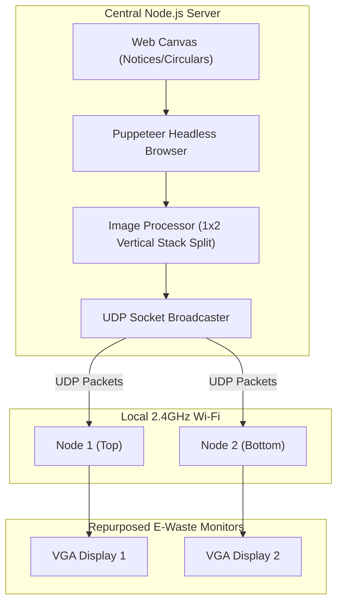

```mermaid
flowchart TD
    subgraph Server["Central Node.js Server"]
        WebUI["Web Canvas (Notices/Circulars)"]
        Headless["Puppeteer Headless Browser"]
        Crop["Image Processor (1x2 Vertical Stack Split)"]
        Tx["UDP Socket Broadcaster"]
        
        WebUI --> Headless --> Crop --> Tx
    end

    subgraph Network["Local 2.4GHz Wi-Fi"]
        Tx --> |UDP Packets| Rx1["Node 1 (Top)"]
        Tx --> |UDP Packets| Rx2["Node 2 (Bottom)"]
    end

    subgraph Hardware["Repurposed E-Waste Monitors"]
        Rx1 --> Mon1["VGA Display 1"]
        Rx2 --> Mon2["VGA Display 2"]
    end
```
