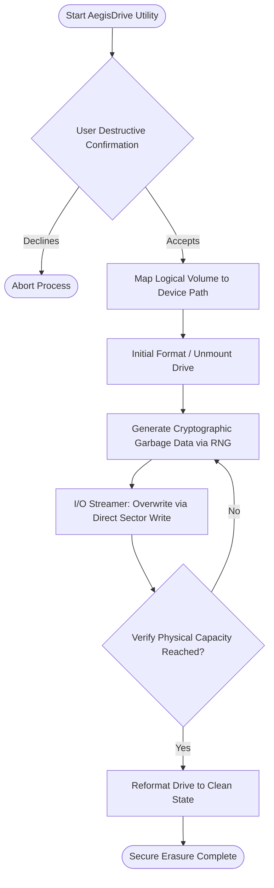

```mermaid
flowchart TD
    A([Start AegisDrive Utility]) --> B{User Destructive Confirmation}
    B -- "Declines" --> C([Abort Process])
    B -- "Accepts" --> D[Map Logical Volume to Device Path]
    D --> E[Initial Format / Unmount Drive]
    E --> F[Generate Cryptographic Garbage Data via RNG]
    F --> G[I/O Streamer: Overwrite via Direct Sector Write]
    G --> H{Verify Physical Capacity Reached?}
    H -- "No" --> F
    H -- "Yes" --> I[Reformat Drive to Clean State]
    I --> J([Secure Erasure Complete])
```
