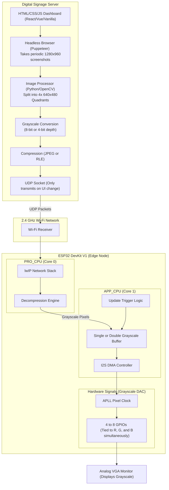

```mermaid
flowchart TD
    subgraph Server["Digital Signage Server"]
        WebUI["HTML/CSS/JS Dashboard (React/Vue/Vanilla)"]
        Headless["Headless Browser (Puppeteer) \n Takes periodic 1280x960 screenshots"]
        Crop["Image Processor (Python/OpenCV)\n Split into 4x 640x480 Quadrants"]
        Gray["Grayscale Conversion \n (8-bit or 4-bit depth)"]
        Encode["Compression (JPEG or RLE)"]
        Tx["UDP Socket (Only transmits on UI change)"]
        
        WebUI --> Headless --> Crop --> Gray --> Encode --> Tx
    end

    subgraph Network["2.4 GHz Wi-Fi Network"]
        Tx --> |UDP Packets| Rx["Wi-Fi Receiver"]
    end

    subgraph ESP32["ESP32 DevKit V1 (Edge Node)"]
        Rx --> Core0
        subgraph Core0["PRO_CPU (Core 0)"]
            NetStack["lwIP Network Stack"]
            Decoder["Decompression Engine"]
            
            NetStack --> Decoder
        end
        
        subgraph Core1["APP_CPU (Core 1)"]
            SyncLogic["Update Trigger Logic"]
            FrameBuffer["Single or Double Grayscale Buffer"]
            DMA["I2S DMA Controller"]
            
            Decoder --> |Grayscale Pixels| FrameBuffer
            SyncLogic --> FrameBuffer
            FrameBuffer --> DMA
        end
        
        subgraph Output["Hardware Signals (Grayscale DAC)"]
            APLL["APLL Pixel Clock"]
            GPIO["4 to 8 GPIOs \n (Tied to R, G, and B simultaneously)"]
            
            DMA --> APLL
            APLL --> GPIO
        end
    end
    
    GPIO --> Monitor["Analog VGA Monitor (Displays Grayscale)"]
```
