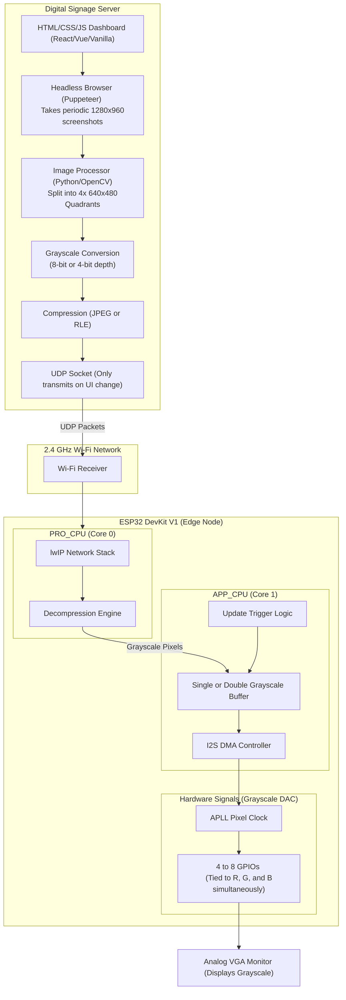

# Comprehensive Software Plan: 2x2 Wireless VGA Digital Signage (ESP32)

> [!NOTE]
> This document outlines the software architecture for a distributed 2x2 wireless VGA video wall optimized for **static documents, UI, and informatics**. By removing color and high-framerate requirements, the system shifts focus to memory conservation, high-resolution grayscale rendering, and a customizable server-side web canvas.

## 1. Software Requirements

### Server-Side (Canvas Engine & Routing)
- **Operating System:** Linux, Windows, or macOS.
- **Canvas Generation Engine:** Node.js with **Puppeteer/Playwright** (Headless Chromium) OR Python with **Pillow/PyQt**. A web-based engine allows you to build the UI using standard HTML/CSS.
- **Image Processing & Routing:** Python (OpenCV/NumPy) or GStreamer to capture the canvas, crop it, convert to grayscale, encode, and transmit via UDP.

### Client-Side (ESP32 Edge Nodes)
- **Development Environment:** Espressif IoT Development Framework (ESP-IDF) utilizing FreeRTOS.
- **Core Libraries:**
  - **VGA Generation:** Bitluni's `ESP32Lib` configured for **custom grayscale output**.
  - **Image Decoding:** `JPEGDEC` (if MJPEG is still used) or a custom lightweight RLE (Run-Length Encoding) decoder for raw grayscale data.
  - **Network:** lwIP (Standard ESP-IDF TCP/IP stack).

---

## 2. Detailed Software Architecture Diagram

---

## 3. Server-Side Canvas Solution

To achieve a highly customizable screen for notices and informatics, the most powerful and flexible approach is utilizing **Web Technologies (HTML/CSS/JS)**.

**The Workflow:**
1. **Design:** You design your 2x2 wall (1280x960 resolution) as a standard web page. You can easily add text, custom fonts, embedded documents, charts, and CSS layouts.
2. **Render & Capture:** A Node.js script using **Puppeteer** runs silently on the server, loading this web page. You can program it to take a screenshot every time a notice is updated, or at a fixed slow interval (e.g., once every 5 seconds).
3. **Process:** The server takes the 1280x960 screenshot, converts it to grayscale, and crops it into four 640x480 quadrants.
4. **Transmit:** Because framerate is irrelevant, the server can slowly and reliably transmit the updated quadrants over the network to the ESP32s.

---

## 4. Grayscale Memory & Hardware Optimization

By abandoning color (RGB), we achieve massive memory savings, allowing the ESP32 to output standard VGA (640x480) or even SVGA (800x600) resolutions.

### The Hardware Trick
A standard VGA cable has dedicated pins for Red (Pin 1), Green (Pin 2), and Blue (Pin 3). To output grayscale, you tie the R, G, and B pins together. This means the ESP32 only needs to drive **one** resistor ladder instead of three.

### Resolution & Depth Trade-offs
Because the ESP32 has roughly ~300 KB of usable heap:

- **Option A: 4-bit Grayscale (16 Shades) - Recommended**
  - Requires only 4 GPIO pins.
  - Memory at 640x480: `640 * 480 * 0.5 bytes = 153.6 KB`.
  - **Advantage:** Leaves plenty of RAM for double-buffering. Screen updates will be completely invisible and tear-free. 16 shades of gray is excellent for text, UI, and basic graphics.
- **Option B: 8-bit Grayscale (256 Shades)**
  - Requires 8 GPIO pins.
  - Memory at 640x480: `640 * 480 * 1 byte = 307.2 KB`.
  - **Advantage:** Very smooth gradients for detailed black-and-white photos.
  - **Disadvantage:** Demands almost all available RAM. Double-buffering is impossible. You must use single-buffering, which means when the server sends an update, a slight horizontal "wipe" or tear will be visible on the screen for a fraction of a second.

---

## 5. Description of Communication Protocols

- **Event-Driven UDP / TCP:** Since high framerate video is discarded, you are no longer strictly bound to UDP's lossy nature. If the display updates infrequently (e.g., a new document is loaded), you can even use **TCP** to guarantee the image arrives perfectly without corruption. The slight latency of TCP is irrelevant for static notices.
- **RLE / JPEG Compression:** JPEG is still excellent for grayscale photos. However, if your UI is mostly solid colors (white backgrounds, black text), **Run-Length Encoding (RLE)** is far more efficient to compress and requires almost zero CPU overhead on the ESP32 to decode.
- **Trigger Sync:** Instead of microsecond RTP timestamp matching, the server can simply send the image payloads to all 4 nodes into a "hidden" buffer, and then broadcast a single tiny UDP trigger packet saying `[SWAP_BUFFERS_NOW]`. This ensures the 2x2 wall updates the notice perfectly simultaneously.

---

## 6. Implementation Steps

1. **Phase 1: Web Canvas & Server Scripting**
   - Create a basic HTML/CSS dashboard for your notices.
   - Write a Node.js Puppeteer script to screenshot the dashboard, crop it, and convert it to a 4-bit grayscale array.
2. **Phase 2: ESP32 Grayscale DAC Design**
   - Build a single 4-bit R2R resistor ladder. Wire its output to the R, G, and B pins of the VGA connector simultaneously.
3. **Phase 3: Bitluni ESP32Lib Customization**
   - Configure ESP32Lib to utilize a custom 4-bit color depth mapped to your specific 4 GPIO pins.
   - Establish a 640x480 resolution mode using the APLL.
4. **Phase 4: Network Handoff**
   - Implement the TCP or UDP listener on the ESP32 (Core 0) to receive the grayscale array and load it into the active framebuffer (Core 1).

---

## 7. Safety Considerations

### 3.3 Hardware Simulation Environment (Wokwi)
To achieve the closest possible hardware-accurate simulation before physical deployment, you will use **Wokwi**, an advanced cycle-accurate simulator for ESP32.

**What Wokwi CAN Simulate (100% Accuracy):**
- **CPU & FreeRTOS Scheduling:** Models the Xtensa dual-core architecture. If your network task on Core 0 preempts your VGA task on Core 1, the simulator will tear or crash exactly like the real hardware.
- **DMA & Memory:** Strictly enforces the ~300KB RAM limits and accurately simulates I2S DMA memory transfers.
- **Digital VGA Logic:** Wokwi provides a built-in `wokwi-vga-monitor` component. You can map your ESP32 GPIOs directly to its R, G, B, H-Sync, and V-Sync inputs to view the generated frame visually in your browser or VS Code.
- **Network Routing:** Wokwi allows you to create a virtual Wi-Fi gateway. You can run your Node.js Puppeteer script locally on your PC and send UDP packets into the simulated ESP32 in real-time.

**What Cannot Be Simulated (The Analog Gap):**
While the digital logic and software execution is identical to real hardware, simulators cannot simulate **analog electrical physics**.
- **Resistor Ladder Impedance:** The simulator assumes perfect digital outputs. It will not show analog ghosting or ringing caused by incorrect physical resistor values.
- **Thermal Dynamics:** The simulator does not overheat at 240MHz. Thermal testing must be done on physical hardware.

- **GPIO Conservation:** Because you only need 4 (or 8) GPIO pins instead of 14, you can easily avoid all dangerous system pins. Safely use pins like 22, 21, 19, 18, 23 (H-Sync), and 4 (V-Sync).
- **Reduced Thermal Load:** Rendering static images and turning off the Wi-Fi modem when not actively receiving an update drastically reduces heat. The ESP32 will run significantly cooler than an AV-over-IP video node.
